# 5212m4硬盘笼的DIY外壳

<!-- @import "[TOC]" {cmd="toc" depthFrom=1 depthTo=6 orderedList=false} -->

<!-- code_chunk_output -->

- [5212m4硬盘笼的DIY外壳](#-5212m4硬盘笼的diy外壳-)
- [概述](#-概述-)
- [安装过程](#-安装过程-)
  - [准备顶盖](#-准备顶盖-)
  - [安装硬盘笼](#-安装硬盘笼-)
  - [安装线材](#-安装线材-)
  - [安装风扇](#-安装风扇-)
  - [安装后窗](#-安装后窗-)
  - [安装调速卡](#-安装调速卡-)
  - [安装底盖](#-安装底盖-)
  - [安装侧面螺丝](#-安装侧面螺丝-)
  - [安装挂耳](#-安装挂耳-)
  - [拧紧所有螺丝](#-拧紧所有螺丝-)
- [直连方案](#-直连方案-)
- [注意事项](#-注意事项-)

<!-- /code_chunk_output -->


```
houchr@yeah.net
```

# 概述

DIY目的：`5212m4浪潮硬盘笼`很适合做个家用的扩展柜，因此想模拟服务器，做个外壳，提供风扇安装位置，调整风道和改进散热。

适应范围：适合`直连主机`的方案，或者多个笼子`串联`。

# 安装过程

## 准备顶盖

因为浪潮5212m4硬盘笼设计有三个定位的立柱，在设计外壳时，考虑保证硬盘笼的完整性，没有选择敲掉立柱的方案，而是通过槽口保留了该立柱的定位功能，以增加稳定性，硬盘笼也不会被破坏。

在以上情况下，先安装顶盖是更方便的，所以我们先从安装顶盖开始。

顶盖通常黏贴有`减震垫片`，同时防止硬盘笼塌腰(浪潮5212m4硬盘笼本身很软)，在发货前一般是贴好的。

 

为了上下盖能紧密贴合，我会故意给上下盖一个向内的`平滑的弧度`，这样在安装后会是`紧密贴合`的，这是利用了钣金的弹性，浪潮硬盘笼自身都是成品定制的紧固件，我没有去花钱定制，不划算。

弧度不需要大，小小的就行，而且是平滑的，不要用力过猛，搞出硬弯就难看了。通常是`双手抓住两边`稍微用力一拱，就形成了，或者上下盖对扣在一起然后向内压中间。

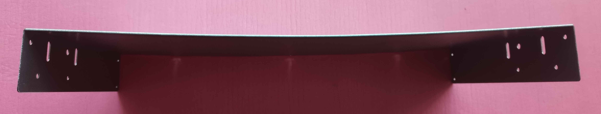

或者弯曲到这样，不要太大。

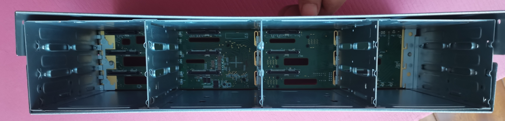

外壳外面的那些螺丝，`都先不拧紧`，后面装差不多调整好时，再一起拧紧。

## 安装硬盘笼

硬盘笼的安装主要是那几个立柱，安装也很简单。

首先将一侧的立柱放到差不多的位置，可以完全放好，也可以稍微搭到位置就行，能达到稍微受力就自动卡进去就行。

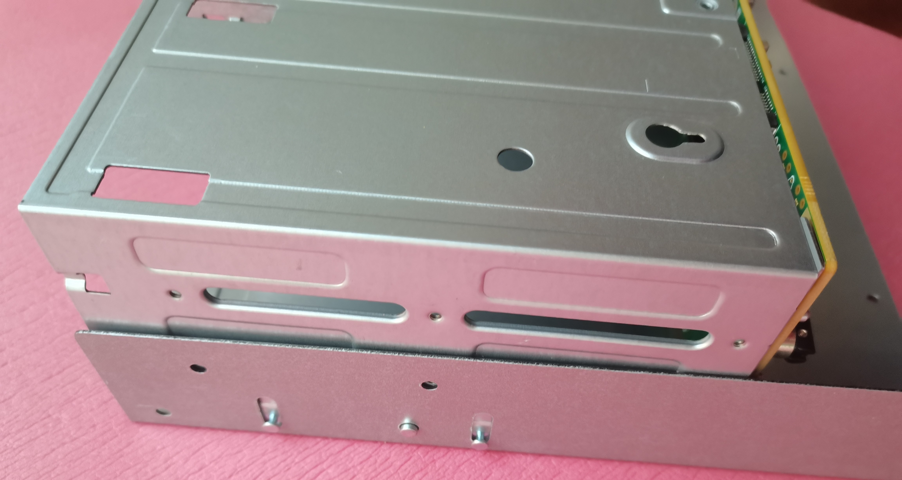

然后将另一侧也放好，在垂直方向上对准孔位。

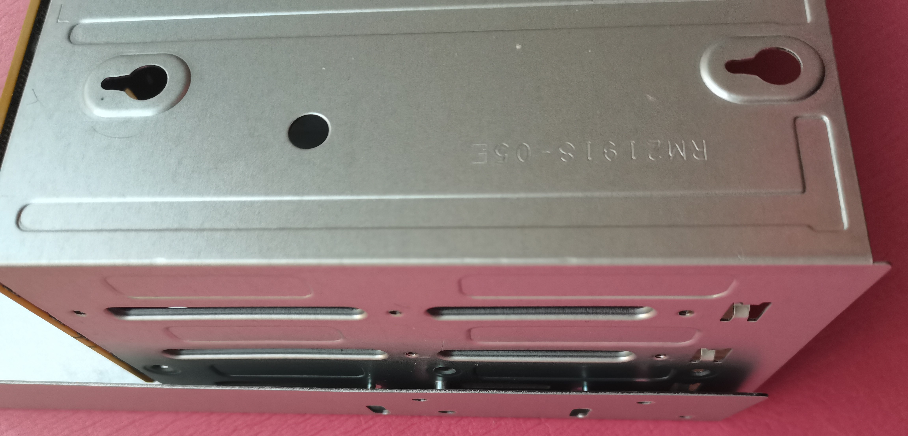

然后向下压就行了，因为给了余量，所以这个很容易压进去。

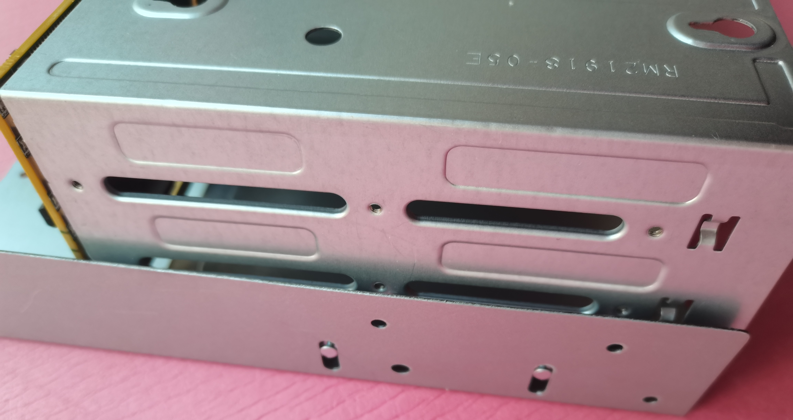

直接压到第三个柱也掉进洞了就可以了。

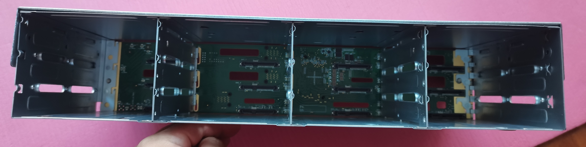

以上是安装硬盘笼，挺容易的。但是拆下硬盘笼，就没办法徒手操作了，需要利用挂耳，将挂耳平的那边，穿入到立柱的区域，然后向上一提，就可以拆下硬盘笼。注意发力的点和挂耳要穿到底到立柱的位置，这样在操作后，挂耳不会弯。挂耳如果弯了，就手工校正一下。

 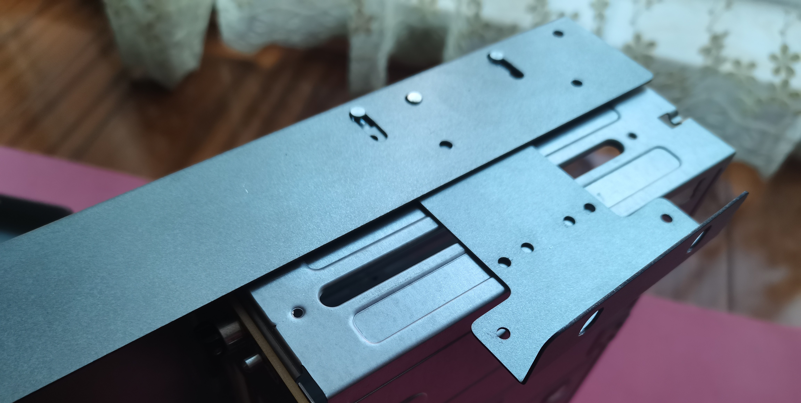

## 安装线材

因为这些外壳设计，考虑要放到家用网络机柜中，我们假设家用网络机柜最小是400mm进深的，因此外壳也会设计的短一些，这样带来的一个问题是内部空间特别的小，去掉硬盘笼和风扇的宽度，中间的空档很小，手不容易在里面操作。

因此，`建议先安装线材`。

 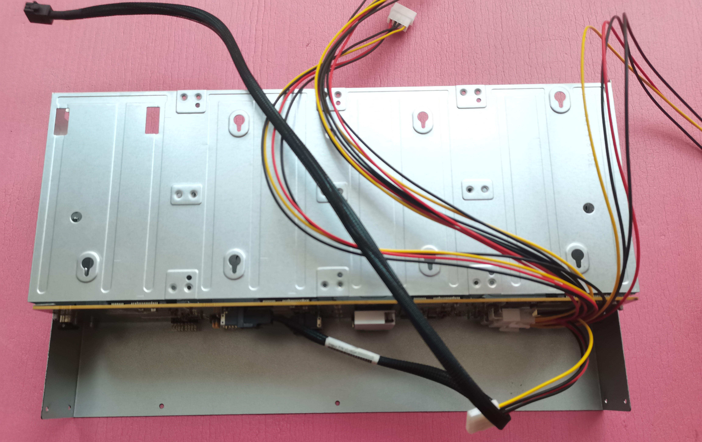

5212浪潮硬盘笼原装线是两头都是8pin公头的线，原装线是插在服务器主板上的，是主板提供的8pin口。想把原装线接到电源上是不行的，需要改线。改线还是要利用电源上的大4p或sata接口，或者只接12v过去然后用12v转5v降压模块模拟5v硬盘供电，我是推荐前者更可靠一些。

大4pin转8pin的供电线，我是有定制的。如果不想自己DIY线，可以直接找我定制的线，长度60cm足够了（太长了也不好）。其他方案可能用不上这个线，每个人的方案可能不同。

## 安装风扇

接下来是安装风扇，找到后窗和风扇，把风扇安装好，先不用接线。这图只装了一个风扇，只是示意。

 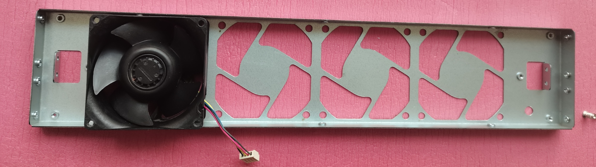

这里需要解释一下，风扇建议使用8038等风压扇。服务器硬盘笼都设计的非常密，需要利用负压抽风来散热。而一盘主机上使用的8025，风压不如8038风扇，所以建议使用8038风扇。但是使用8038风扇，很多朋友会担心噪音问题，确实8038不如8025静音。

我建议是两种情况，如果使用8038风扇，则利用PWM调速卡等方式，将风扇转速调到1500到2500转之间，是一个还能接受的噪音范围，1500转已经很安静了，基本只有风噪小小的声音，2500转是兼顾了噪音和散热。如果使用8025，那就不上满盘，只上一部分盘位，以空闲的盘位做风道，让8025也能形成合适的风道风速。

8038风扇要选择功率低的，电流1A以下的，防止有些线和卡是电流过载。我用的建准的8038，满速才6.1w就挺好。

建议淘宝购置风扇`防护网`，很便宜，防止线材和风扇有干扰。

在不上满盘时，可以参考如下图方式放硬盘（6盘位），其他盘数自行发挥吧。


## 安装后窗

找到后窗，和刚才安装的顶盖放一起，对准孔位。

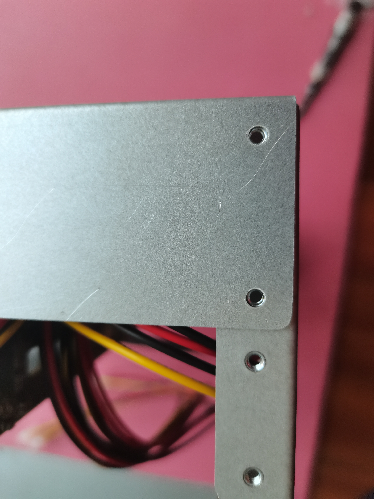

拧上螺丝，但别拧紧。

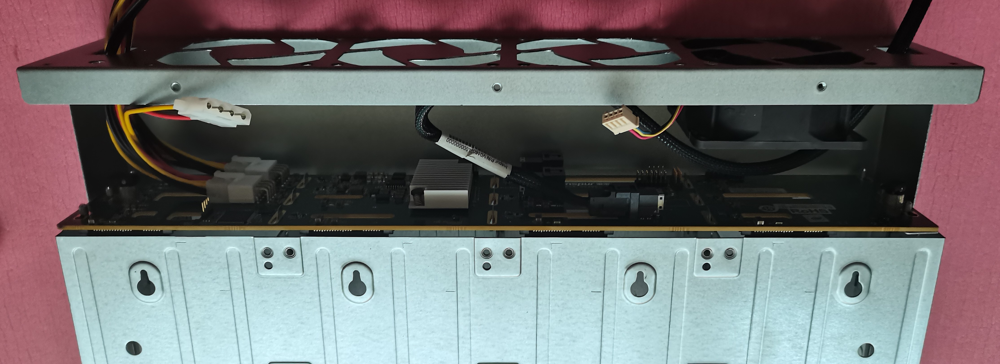

## 安装调速卡

如果要用PWM调速卡，可以在这步把调速卡安装上：

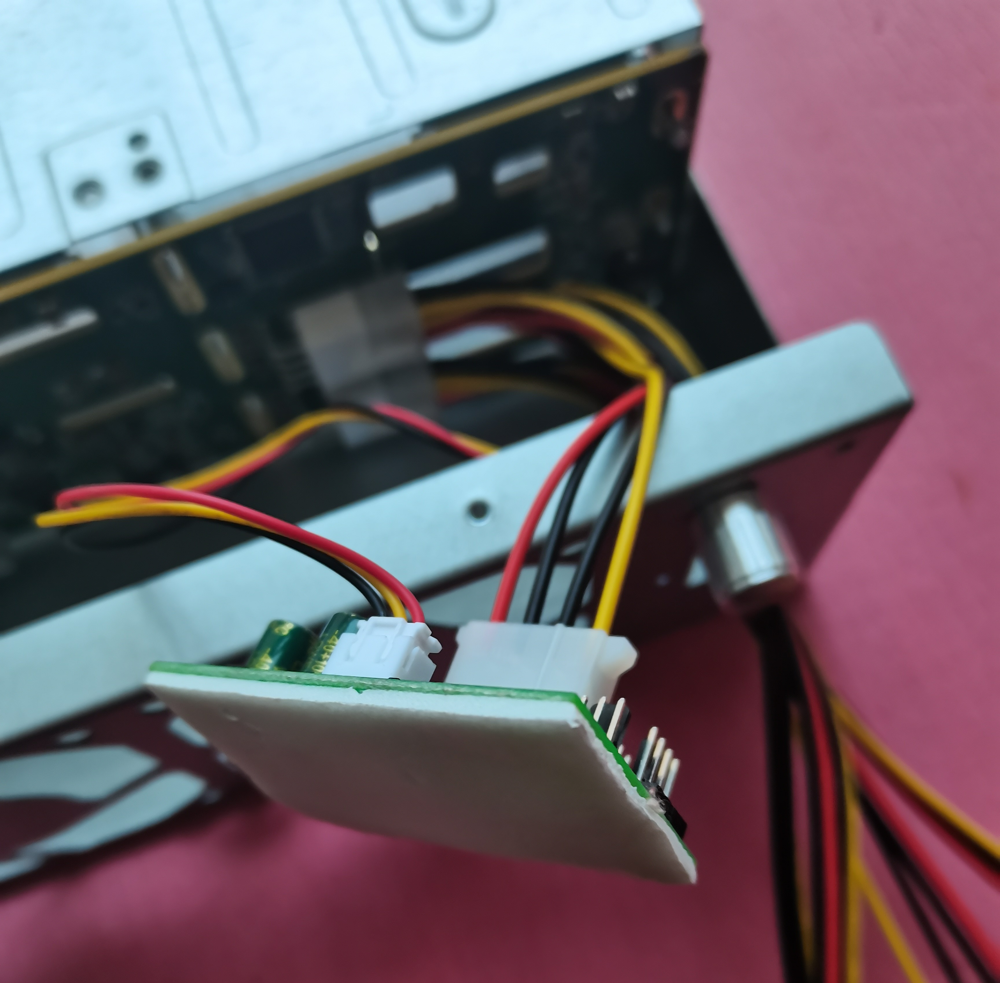

如果不安装调速卡，就利用大4p供电或小4pin一分二延长线（注意电流别过载），这个根据自己的风扇连接方案去想怎么处理风扇供电。

## 安装底盖

底盖和顶盖一样，给出一定的弧度，同样不要用力过猛，差不多就行。

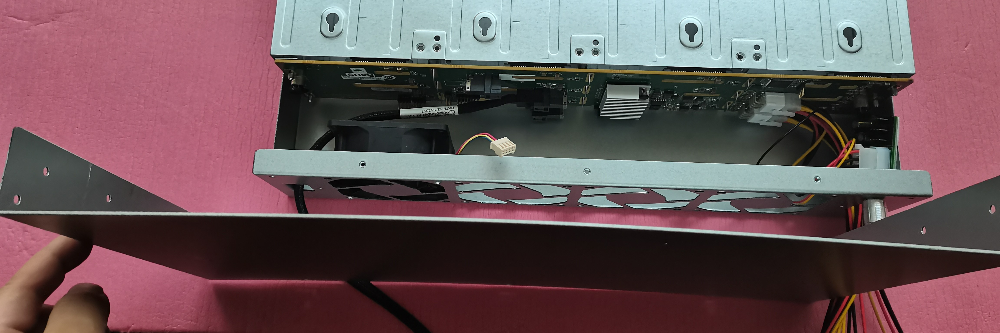

底盖直接装上就可以了，螺丝先不要拧紧，一会再一起拧紧。

## 安装侧面螺丝

这一步去固定硬盘笼，把侧边螺丝都安装上。只是把螺丝拧进去，定位好，先不要拧紧。然后用手捏紧上下盖，让缝隙最小化，此时再拧紧螺丝。


同样，后窗的固定螺丝，也是这个过程。

需要说明的是，上8038风扇，风压可以搞很大，有时会利用这个缝隙去给背板和扩展芯片补冷风(因为从前面进的风已经被硬盘加热了)，这个不是必须给缝，根据自己测试和自己经验决定。

## 安装挂耳

如果想安装挂耳，就是在上一步安装侧面螺丝时，先把挂耳对好孔，把挂耳也拧上就行。

需要说明的是挂耳只是为了上机柜时定位和不乱动，不是用于承重的。

通常硬盘很重，这种硬盘多的要上托盘去承重，很多存储服务器也是需要托盘来承重的。

## 拧紧所有螺丝

所有螺丝都上到位，也不用拧太紧，能达到固定不会运行一段时间松开就行。

# 直连方案


硬盘笼供电线可以给风扇供电，可以使用我DIY的带大4P输出的供电线，则可少拉一条线。

串联的方案，以及独立电源的方案，连接的方案每个人可能都有自己的方案，总之是给硬盘笼背板和风扇供电，接上输入输出的数据线。

# 注意事项

- 整机为了简化工序和减少造价，没有设计应力结构，在上机柜时需要托盘。其实12盘和24盘存储服务器有的也会上托盘，防止塌腰；
- 挂耳仅用于上机柜时定位，不能承重；
- 建议不要使用垃圾电源，注意使用电源的安全事项，注意使用电子设备的安全事项，本DIY产品只是外壳，不会详细描述该项内容的注意事项；
