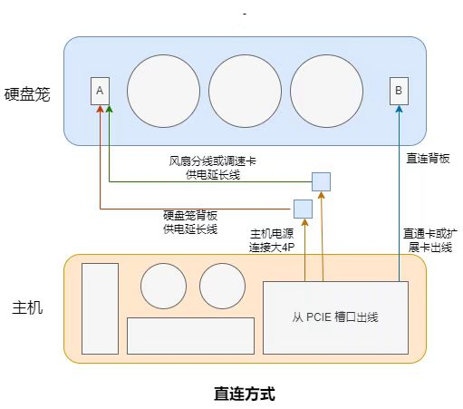

# 5212m4硬盘笼的DIY外壳

<!-- @import "[TOC]" {cmd="toc" depthFrom=1 depthTo=6 orderedList=false} -->

<!-- code_chunk_output -->

- [5212m4硬盘笼的DIY外壳](#-5212m4硬盘笼的diy外壳-)
- [概述](#-概述-)
- [安装过程](#-安装过程-)
  - [准备顶盖](#-准备顶盖-)
  - [安装硬盘笼](#-安装硬盘笼-)
  - [安装线材](#-安装线材-)
  - [安装风扇](#-安装风扇-)
  - [安装后窗](#-安装后窗-)
  - [安装调速卡](#-安装调速卡-)
  - [安装底盖](#-安装底盖-)
  - [安装侧面螺丝](#-安装侧面螺丝-)
  - [安装挂耳](#-安装挂耳-)
  - [拧紧所有螺丝](#-拧紧所有螺丝-)
- [直连方案](#-直连方案-)
- [注意事项](#-注意事项-)

<!-- /code_chunk_output -->

# 概述

DIY目的：`5212m4浪潮硬盘笼`很适合做个家用的扩展柜，因此想模拟服务器，做个外壳，提供风扇安装位置，调整风道和改进散热。

适应范围：适合`直连主机`的方案，或者多个笼子`串联`。

# 手册下载

<a href="./5212m4_diy_case_setup.pdf">5212m4安装手册</a>

# 直连方案

硬盘笼供电线可以给风扇供电，可以使用我DIY的带大4P输出的供电线，则可少拉一条线。

串联的方案，以及独立电源的方案，连接的方案每个人可能都有自己的方案，总之是给硬盘笼背板和风扇供电，接上输入输出的数据线。

# 注意事项

- 整机为了简化工序和减少造价，没有设计应力结构，在上机柜时需要托盘。其实12盘和24盘存储服务器有的也会上托盘，防止塌腰；
- 挂耳仅用于上机柜时定位，不能承重；
- 建议不要使用垃圾电源，注意使用电源的安全事项，注意使用电子设备的安全事项，本DIY产品只是外壳，不会详细描述该项内容的注意事项；
